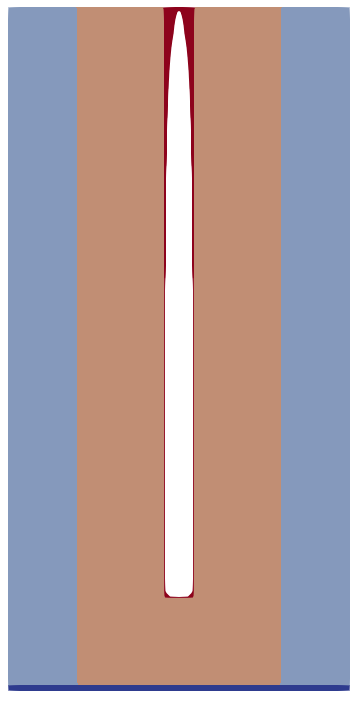

# AirSpacerModel

Example application demonstrating the use of cubic spline interpolation for interpolating between results of physical deposition simulations. 

## Building
### Supported Operating Systems

* Windows (Visual Studio)
* Linux (g++ / clang)
* macOS (XCode)

### System Requirements

* C++17 Compiler with OpenMP support

### Dependencies
* Required:
    * [ViennaLS](https://github.com/ViennaTools/ViennaLS)
    * LAPACK
* Optional:
  * [ViennaPS](https://github.com/ViennaTools/ViennaPS)

### Compiling
If the above requirements are fulfilled, one can use the following commands to clone and compile the project:

```bash
git clone https://github.com/yozoon/AirSpacerModel.git
cd AirSpacerModel/
mkdir build && cd build
cmake ..
make
```

## Usage

The _data.csv_ file contains data sampled from a regular grid of the parameter space with the following values:

| Parameter | Values |
| --- | --- |
| _aspectRatio_ | 10, 30, 50, 70, 100 |
| _leftTaperAngle_ | -2°,-1°,0°, 1°,2° |
| _stickingProbability_ | 0.1, 0.07, 0.04, 0.01 |
| _normalizedTime_ | 0.0, 0.1, 0.2, 0.3, 0.4, 0.5, 0.6, 0.7, 0.8, 0.9, 1.0 |

The _normalizedTime_ is normalized to the time it takes to deposit a layer with a thickness of the trench top width on top of the substrate (assuming a rate of 1). Thus, if a _normalizedTime_ value of 1.0 is chosen, the trench is almost guaranteed to be closed.

When the _AirSpacerEmulation_ executable is invoked, a volume _.vtu_ file is generated, which shows all layers of the geometry after the deposition process, created through cubic spline interpolation of geometric features based on the provided data samples (_data.csv_ file). The GeometricAirSpacerModel also creates a separate levelset for the conformal dielectric liner.



```bash
./AirSpacerEmulation data.csv config.txt
```

You can update the values in the _config.txt_-file in your build directory to match your desired configuration.
